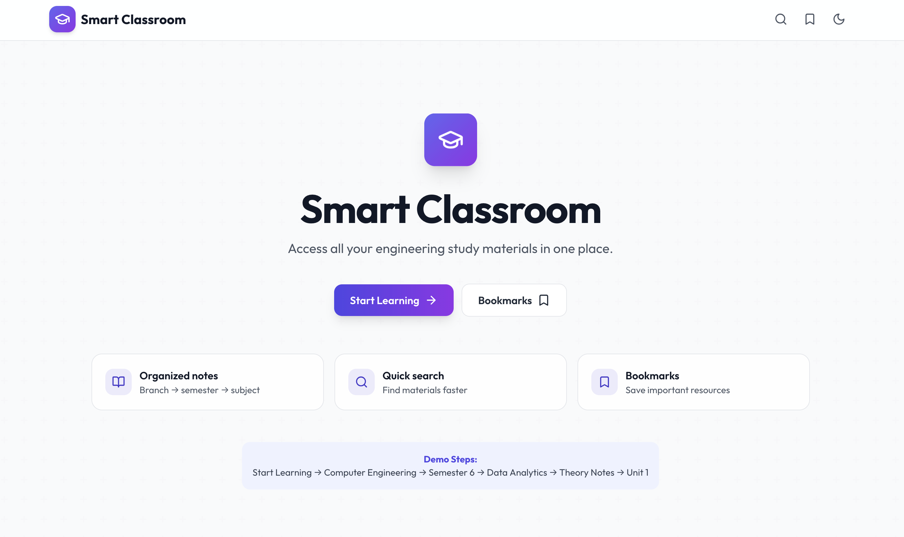
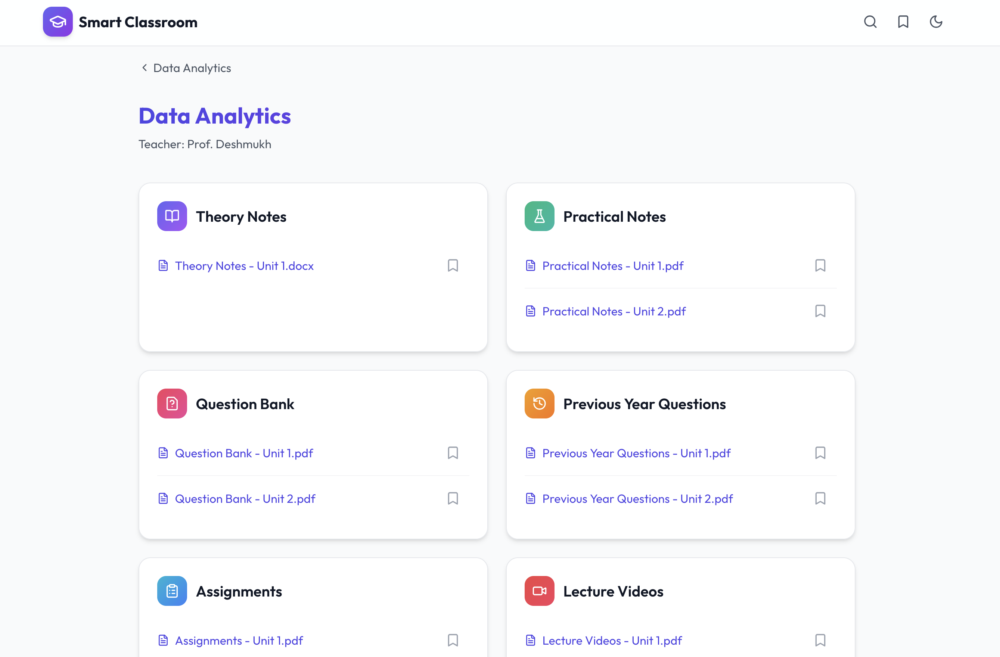
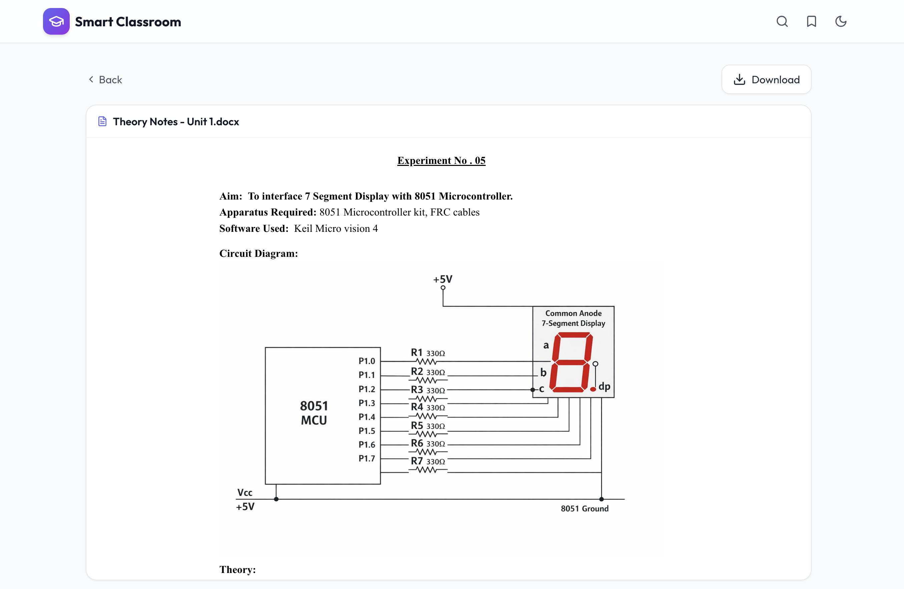
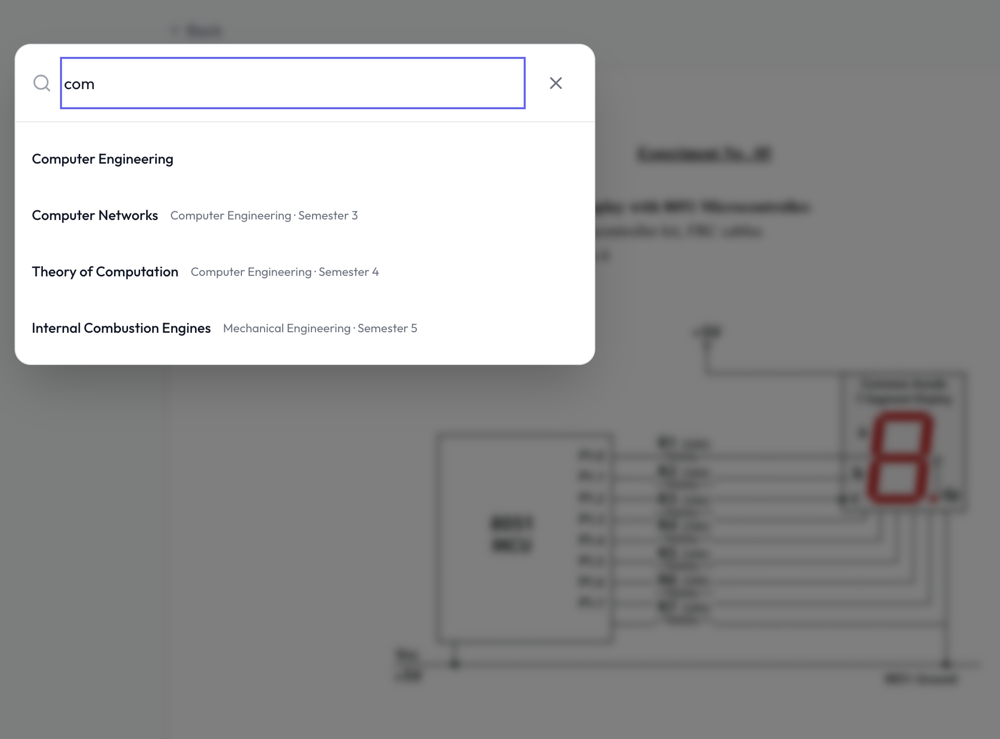

# 🌟 StudyGrid

[](https://react.dev/)
[](https://vitejs.dev/)
[](https://tailwindcss.com/)
[](https://firebase.google.com/)

**StudyGrid** is a professional engineering study portal designed to streamline the academic experience for students. It provides a centralized platform to access theory notes, practical materials, question banks, and lecture videos across multiple engineering branches and semesters.

---

## 📖 Table of Contents
- [✨ Features](#-features)
- [🛠️ Technologies Used](#️-technologies-used)
- [📂 Project Structure](#-project-structure)
- [🚀 Quick Start](#-quick-start)
- [🚀 Usage](#-usage)
- [🖼️ Screenshots / Demo](#️-screenshots--demo)
- [🔌 API Integration](#-api-integration)
- [🔮 Future Improvements](#-future-improvements)
- [👤 Author](#-author)

---

## ✨ Features
- **📚 Comprehensive Resource Library**: Organized by Engineering Branch (Computer, Mechanical, Civil, Electrical) and Semester.
- **📂 Multiple Resource Types**: Access Theory Notes, Practical Notes, Question Banks, Previous Year Papers, Assignments, and Lecture Videos.
- **🔖 Personal Bookmarks**: Save important resources to your personal bookmark list for quick offline-like access.
- **🌓 Adaptive UI**: Fully supports Light and Dark modes with a sleek, modern aesthetic.
- **🔍 Quick Search**: Integrated search modal to find subjects and materials instantly.
- **📄 In-Browser Viewer**: Seamlessly view DOCX and PDF documents without leaving the platform.
- **📱 Mobile Responsive**: A fluid design that works perfectly on smartphones, tablets, and desktops.

---

## 🛠️ Technologies Used
- **Frontend**: [React 19](https://react.dev/), [Vite](https://vitejs.dev/)
- **Styling**: [Tailwind CSS](https://tailwindcss.com/)
- **Icons**: [Lucide React](https://lucide.dev/)
- **Routing**: [React Router 7](https://reactrouter.com/)
- **Backend/Services**: [Firebase](https://firebase.google.com/) (Auth, Database, Storage)
- **Document Rendering**: `docx-preview`
- **Deployment**: [Vercel](https://vercel.com/) / [GitHub Pages](https://pages.github.com/)

---

## 📂 Project Structure
```text
StudyGrid/
├── public/                 # Static assets and sample documents
│   └── pdfs/               # Categorized resource files
├── src/
│   ├── components/         # Reusable UI components (Layout, Search, etc.)
│   ├── context/            # State management (Bookmarks, Theme)
│   ├── data/               # Constants and configuration files
│   ├── lib/                # Third-party library initializations (Firebase)
│   ├── pages/              # Main application views/routes
│   ├── App.jsx             # Main application component
│   └── main.jsx            # Application entry point
├── tailwind.config.js      # Styling configuration
├── vite.config.js          # Build tool configuration
└── vercel.json             # Deployment configuration
```

---

## 🚀 Quick Start

### Option 1: Source Code Deployment (Recommended)

#### Prerequisites

| Tool | Version | Description | Check Installation |
| :--- | :--- | :--- | :--- |
| **Node.js** | 18+ | Frontend runtime, includes npm | `node -v` |
| **Frontend** | React 19, Vite 8 | Modern UI framework and build tool | `npm list react vite` |
| **Backend/DB** | Firebase 11 | Authentication and cloud database | `npm list firebase` |
| **Languages** | JS, HTML5, CSS3 | Core development languages | - |

### 1. Configure Environment Variables

Create a `.env` file in the root directory:
```bash
cp .env.example .env
```
Edit the `.env` file and fill in your Firebase configuration keys.

### 2. Required Environment Variables

```env
VITE_FIREBASE_API_KEY=your_api_key
VITE_FIREBASE_AUTH_DOMAIN=your_auth_domain
VITE_FIREBASE_PROJECT_ID=your_project_id
VITE_FIREBASE_STORAGE_BUCKET=your_storage_bucket
VITE_FIREBASE_MESSAGING_SENDER_ID=your_messaging_sender_id
VITE_FIREBASE_APP_ID=your_app_id
```

### 3. Installation & Setup

1. **Clone the repository**
   ```bash
   git clone https://github.com/atharv-pokale/StudyGrid.git
   cd StudyGrid
   ```

2. **Install dependencies**
   ```bash
   npm install
   ```

3. **Start the development server**
   ```bash
   npm run dev
   ```

---

## 🚀 Usage
1. **Select your Branch**: Choose from Computer, Mechanical, Civil, or Electrical Engineering.
2. **Choose Semester**: Navigate through the specific semester you are currently in.
3. **Explore Subjects**: Click on a subject to see available resources.
4. **View/Download**: Open theory notes or watch lecture videos directly.
5. **Bookmark**: Click the bookmark icon on any resource to save it for later.

---

## 🖼️ Screenshots / Demo

| Home Page | Subject Dashboard |
| :---: | :---: |
|  |  |

| Viewer Mode | Search Functionality |
| :---: | :---: |
|  |  |

| Dark Mode |
| :---: |
|  |

---

## 🔌 API Integration
- **Firebase Authentication**: Manages user sign-in and session persistence.
- **Firebase Firestore**: Stores subject metadata, resource links, and user bookmarks.
- **Firebase Storage**: Hosts the physical PDF and DOCX files for student access.

---

## 🔮 Future Improvements
- [ ] **AI-Powered Summarization**: Automatically generate summaries for long theory notes.
- [ ] **Interactive Quizzes**: Add self-assessment quizzes for each subject.
- [ ] **Community Forum**: A space for students to discuss topics and share doubts.
- [ ] **Offline Mode**: PWA support for accessing bookmarked notes without internet.
- [ ] **Teacher Portal**: Dedicated dashboard for faculty to upload and manage resources.

---

## 👤 Author
**Atharv Pokale**
- 💼 [LinkedIn](https://www.linkedin.com/in/atharv-pokale-dev/)

---
⭐️ If you found this project helpful, please give it a star!
